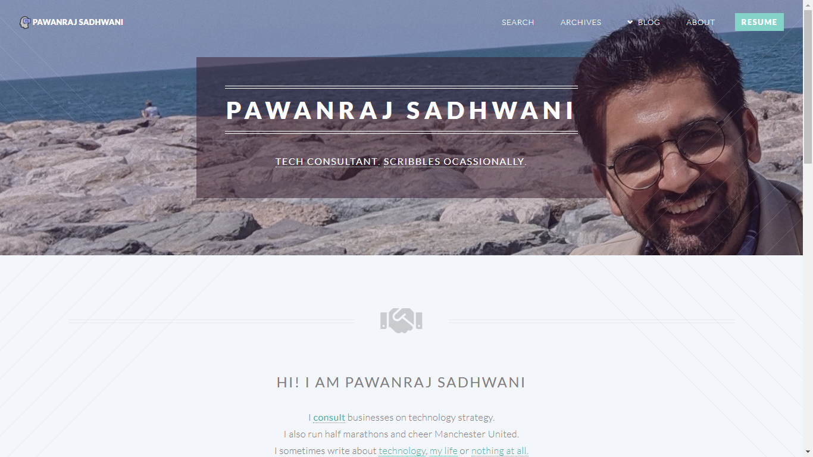

# twenty-html5up-pelican

This is port of the [Twenty Theme by HTML5Up](https://html5up.net/twenty) for Pelican. It's minimally designed, fully responsive and built on HTML5/CSS3. Thanks also to [Frank Valcarel](http://frankvalcarcel.com/) whose port I used as a starting point. I reworked a lot of it to remove the dependency of `skel.js` and add customizations.

Feel free to use it, as long as you attribute it!


## Contributing

If you want to adjust this theme to your own liking, feel free to fork it. If you want to make improvements that are useful to others and can make the theme better in general **please don't hesitate to make a pull request**.


## Pre-Requisites

These might be useful for you to prep your virtual environment to properly install the theme.

- Needs `pyyaml`, `beautifulsoup4`, `markdown` and `lxml`. 
- Uses `pelican-share-post`, `pelican-neighbors`, and `pelican-tag-cloud` plugins


## Installation

1. `git clone https://github.com/pawanrajs/twenty-html5up-pelican.git`
2. Point the `THEME` variable in your `pelicanconf.py` to `/path/to/theme-folder`
3. Install the following plugins in your virtual environment using `pip install <plugin-name>` (This is the new way of installing plugins, as opposed to the older way of copying the `.py` files in your plugins directory)
    - **pelican-share-post**: to create a list of simple non-tracking URLs to share your blog / article.
    - **pelican-neighbors**: to show the next and previous article / blog entry on each article
    - **pelican-tag-cloud**: to create a tag cloud
4. Specify the `PLUGINS` in your `pelicanconf.py` as `PLUGINS = ['pelican.plugins.tag_cloud', 'pelican.plugins.share_post', 'pelican.plugins.neighbors']`
5. Use the supplied `pelicanconf.py` sample to update information. See usage and configuration details below.
6. Create filters that are used in the theme:
    - Create a `utils` folder on the same level as your `pelicanconf.py` and create a `filters.py` and `__init__.py` in this folder. 
    - Add the following functions into `filters.py`

        ```python
        from datetime import datetime

        # To use sidebar format for archive.html and category.html only`
        def sidebar(val):
        if val.startswith('archives') or val.startswith('category'):
            return 'right-sidebar'
        elif val == 'index':
            return 'index'
        else:
            return 'no-sidebar'

        # Filter to find difference between two timestamps in days. Used in comments.html
        def datediff(subtract_date, subtract_from=datetime.now().timestamp()):
        return round((float(subtract_from) - float(subtract_date))/(60*60*24))
        ```
    - Update `pelicanconf.py` to register these jinja2 filters to Pelican

        ```python
        import sys
        sys.path.append('.')
        from utils import filters

        JINJA_FILTERS = {
        'sidebar': filters.sidebar,
        'datediff': filters.datediff
        }
        ```


## Usage & Configuration

### Site Brand

You can provide a logo for your site using `SITELOGO`. For example: `SITELOGO = 'images/my_site_logo.png'`. You can then define the size of the logo using `SITELOGO_SIZE`. The `width` of the `` element will be set accordingly.

By default the `SITENAME` will be shown as well. It's also possible to hide the site name using the `HIDE_SITENAME` flag.


### Custom CSS

I use `custom.css` to update styles for pagination, tags, comments, search etc which are not in the original twenty theme packet. To add your own custom css to the theme, without having to clone and maintain your own version of the theme, you can use `CUSTOM_CSS` variable. The value is the location where you tell Pelican to put the file (see below):

```
CUSTOM_CSS = 'css/custom.css'
```

You can put your `custom.css` in a path you want, and tell Pelican to copy it to the desired destination. For this, add the path to `STATIC_PATHS` and the destination to `EXTRA_PATH_METADATA`:

```python
# Tell Pelican to add files from 'extra' to the output dir
STATIC_PATHS = ['images', 'extra']

# Tell Pelican to change the path to 'css/custom.css' in the static dir of the theme
EXTRA_PATH_METADATA = {
    'extra/custom.css': {'path': join(THEME_STATIC_DIR, CUSTOM_CSS)}
}
```


### Banner Image

A banner image can be added to the theme, displayed with the SITENAME and an optional subtitle. Banner is only shown on the index page. Config options are as follows:

- Set the banner image with `BANNER = '/path/to/banner-image.jpg'`.
- In `pelicanconf.py`, add the following detail in your `EXTRA_PATH_METADATA` variable to copy your banner image to the correct location in the theme directory. This is because banner image is a background in the css.

```python
EXTRA_PATH_METADATA = {
    BANNER : {'path': join(THEME_STATIC_DIR, 'images/banner.jpg') }
}
```
- Set the subtitle text with `BANNER_SUBTITLE = 'This is my subtitle'`. Html is allowed in the subtitle (if you want to add links to the subtitle, for example).


### Favicon & Touchicon

Set the `FAVICON` option in your `pelicanconf.py`. For example: `FAVICON = 'images/favicon.png'` and `TOUCHICON = 'images/touchicon.png'`


### Navbar Settings

On larger screens, navbar menu items (except brand) are right aligned, and are in the following order from left-to-right:
- `MENUITEMS`: Standard Pelican setting with tuple of `(text, link)` tuples 
- `DISPLAY_CATEGORIES_ON_MENU`: Standard Pelican setting to display all categories on navbar.
- `DISPLAY_PAGES_ON_MENU`: Standard Pelican setting to display all pages on navbar. By default, title of the page is used as label of the navbar menu item for the page. To specify a different text for the link, specify a `Menulabel: <text>` attribute to the page metadata when writing the markdown
- `MENU_SPECIAL_BUTTON_LABEL`: **Not standard in Pelican**. Is used to put an Action Button on the rightmost edge of navbar. Is a tuple with `(link text, link)` for the special button.

- **CREATING A SUBMENU**: You can specify `DISPLAY_CATEGORIES_AS_SUBMENU = True` to display categories as a submenu on the navbar. For this to work, `DISPLAY_CATEGORIES_ON_MENU` **must** be `True`. Use the setting `CATEGORY_SUBMENU_TITLE` to specify the label of submenu displayed on the navbar.


### Pagination

Pagination needs to be specified separately for all direct templates as below: 
`PAGINATED_TEMPLATES = {'index': 3, 'category': 5, 'archives': 5, 'tag': 5, 'author': 5}`


### Introduction on Index Page

As you can see in the screenshot, after the banner, a short introduction section is present before the posts are present. This is useful for personal pages. You can toggle this by setting the `INDEX_INTRODUCTION` variable to `False`. To show an introduction, set `INDEX_INTRODUCTION` to the html snippet you want to render, e.g. `includes/index_introduction.html` and modify the snippet as you like.


### Featured Article

`SHOW_FEATURED_ARTICLE` variable can be set in `pelicanconf.py` to make space for a special featured article with a blue background, on page. Default is `False`. 

Currently, featured article (includes/featuredpost.html) is set to show a random post from among all the available articles in your content, at every regeneration of the site. Feel free to change it to show what you like.


### Footer

The footer will display a copyright message using the `AUTHOR` variable and the year of the latest post. 

It will also display social media links based on `SOCIAL` variable. `SOCIAL` is a tuple of tuples with each tuple being `(fontawesomeicon, <link>)`. For example `('twitter', <link>)` will create show up with a circular twitter font-awesome icon (fa-twitter) and link specified.


### Article / Page specific metadata in Markdown

- Use `Template: <templatename>` to use `templatename.html` as template for that page
- On a page, there's an option to use an image for the page by specifying `image: <path/to/image>` in markdown metadata
- On a page, use `Menulabel: <menulabel>` to use a specific label on the menu item for the page, instead of page title.
- To display the appropriate icon on individual article pages / article columns on index.html, specify `Icon: <fontawesome_icon_name>` in metadata. For example `Icon: cloud` will use the fontawesome `fa-cloud` svg as article icon.


### Tipue Search Plugin

This theme has support for the [Tipue Search plugin](https://github.com/getpelican/pelican-plugins/tree/master/tipue_search). This is a jQuery plugin that will search the static site without using any third party service, like DuckDuckGo or Google. 

To enable the plugin:
1. Enable the plugin (Copy `tipue_search.py` to plugins directory and register it in `pelicanconf.py` `PLUGINS`).
2. Add `'search'` to the `DIRECT_TEMPLATES` in your `pelicanconf.py`. E.g. `DIRECT_TEMPLATES = ('index', 'categories', 'authors', 'archives', 'search')`.

By default, the Tipue search page is configured at "/search.html", but you can override that with the `SEARCH_URL` setting.

The theme will add a search box on the right sidebar of `archives.html` in addition to the search page itself.


### Share This Plugin

`share_post` creates old school URLs (that cannot be tracked) for some sites (facebook, email, twitter, linkedin, hacker-news and reddit) which your theme can use. 

Install `beautifulsoup4` in your venv, and enable the `share_post` plugin to enable this. Use `SHARE_POST_INTRO` variable in your `pelicanconf.py` to specify the label for sharing list. Default is 'Share on: '.


### Tag Cloud

`tag_cloud` plugin is used to display tag cloud. Refer to [the documentation here](https://github.com/StevenMaude/pelican-tag-cloud) to specify tag cloud settings in `pelicanconf.py`


### Comments using Staticman

Comments are enabled using [staticman](https://staticman.net/), instead of Disqus to get away from third-party ownership & tracking issues and make content of comments searchable in the site. With Staticman, comments are converted to data-files (.yml files) that are merged into the repository containing the rest of the content. 

However, enabling staticman comments *is* a little more involved. **You will need the below**:
- The ability to deploy your site automatically (e.g. Github actions, netlify). This is not necessary but manual deployment will mean you'll have to push a new site out to Github for comments, manually.
2. A host for Staticman instance (I use Heroku. It's free for my limited use. Dynos spin-down which means a long latency for the first comment after a long time)
3. `pyyaml` package (pip install it in your environment)

Here are the steps to follow to setup **moderated comments** (using Heroku), and assuming you're using GitHub to store your files:

1. Allow comments by specifying `COMMENTS_ENABLED = True` in the `pelicanconf.py` configuration file (default is `False`).
2. Create a `comments` folder in your `content` directory.
3. Setup Staticman
    - Deploy a staticman instance. For Heroku, [you'll create an app with it using this link](https://heroku.com/deploy?template=https://github.com/eduardoboucas/staticman/tree/master). **More importantly**, think of a good name for the app, because you'll be referring to the URL for it in other steps (usually as `<appname>.herokuapp.com` for free versions)
    - Create a Github application as mentioned in the [getting-started guide Step: 1 Option: 1](https://staticman.net/docs/getting-started). Make sure you generate and save the private key for the app.
    - Generate a RSA key for encrypting sensitive configuration parameters with. Use command below to generate, and save it in file.
        ```bash
        openssl genrsa
        ```
    - Add the config variables in Heroku app:
        - `GITHUB_PRIVATE_KEY` contains the RSA key generated for Github App
        - `RSA_PRIVATE_KEY` contains key generated in previous step
    - Install the Github App and Heroku Staticman instance
4. Copy the sample `staticman.yml` provided to root of your venv and make the following changes 
    - Set `branch` to name of the github branch on which your content exists. 
    - Set `name` to the URL of your website
    - You will get an email to merge a pull request created by Staticman with every comment. To merge automatically, set `moderation: false`.
5. Setup your form action in `pelicanconf.py` using the `STATICMAN_FORM_ACTION` variable. If using Github, the action will be `'https://<heroku_staticman_app_url>/v3/entry/github/<github_user>/<github_repo>/<branch>/comments'`
6. Create a `pelicanconf.py` variable called COMMENTS as follows. NOTE: This code requires `pyyaml` package:
    ```python
    commentsPath = join(PATH, 'comments')
    
    def ymlToJson(file):
        if isfile(file):
            with open(file) as stream:
                return yaml.load(stream)

    filenames = []
    for directory, subdirs, files in walk(commentsPath):
        filenames.extend([join(directory, f) for f in files])

    COMMENTS = list(map(ymlToJson, filenames))
    ```


## Live example

- [This is my website based on the theme](https://pawanrajs.com). 
- [Frank Valcarel's site](http://frankvalcarcel.com/) uses an older version of the theme based on `skel.js`


## Known Issues / To-dos

- A bunch of css is in my `custom.css` which is not yet part of the main theme file. I need to refactor this to make it work.
- `author.html` is not present, since I created this for my personal site where I did all the writing!
- There's no DISQUS, FEED, or Analytics support yet. I will eventually get to it. These are either to be done, or to be tested. If someone wants to do it, go ahead and raise a PR, or fork/clone and hack away!
- Convert filters into a plugin for easy install and maintenance.

## Screenshots




